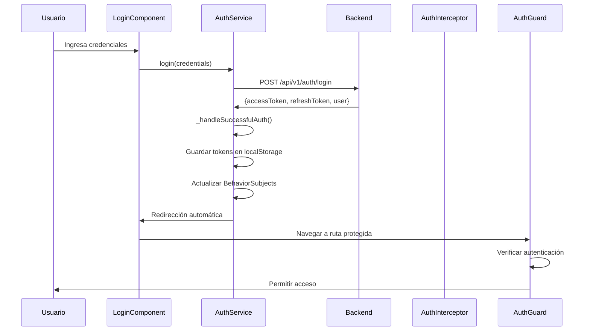

# 🔐 Implementación del Sistema de Login - Pritzio Frontend

## 📋 **Resumen de la Implementación**

### **Estado Actual**
✅ **FUNCIONANDO** - Sistema de login completamente operativo con autenticación JWT, refresh tokens y redirección automática.

### **Funcionalidades Implementadas**
- Login con email/username y contraseña
- Autenticación JWT con access tokens (15 min) y refresh tokens (7 días)
- Redirección automática según tipo de usuario (admin/dashboard)
- Manejo de errores con logging detallado
- Interceptor HTTP para agregar tokens automáticamente
- Refresh automático de tokens expirados
- Logout con limpieza de datos

---

## 🏗️ **Arquitectura del Sistema**

### **Componentes Principales**

#### **1. AuthService** (`src/app/core/services/auth.service.ts`)
```typescript
@Injectable({
  providedIn: 'root'
})
export class AuthService {
  private _currentUser = new BehaviorSubject<IUser | null>(null);
  private _isAuthenticated = new BehaviorSubject<boolean>(false);
  private _isAdmin = new BehaviorSubject<boolean>(false);

  // Métodos principales
  login(credentials: ILoginRequest): Observable<IBackendAuthResponse>
  register(userData: IRegisterRequest): Observable<IBackendAuthResponse>
  refreshToken(): Observable<IBackendAuthResponse>
  logout(): void
}
```

#### **2. AuthInterceptor** (`src/app/core/interceptors/auth.interceptor.ts`)
```typescript
export const authInterceptor: HttpInterceptorFn = (request, next) => {
  // Agrega token a todas las requests
  // Maneja refresh automático en caso de 401
  // Redirige a login si refresh falla
}
```

#### **3. AuthGuard** (`src/app/core/guards/auth.guard.ts`)
```typescript
@Injectable({
  providedIn: 'root'
})
export class AuthGuard implements CanActivate {
  canActivate(): Observable<boolean | UrlTree> {
    // Verifica si el usuario está autenticado
    // Redirige a login si no lo está
  }
}
```

#### **4. LoginComponent** (`src/app/features/auth/components/login/login.component.ts`)
```typescript
@Component({
  selector: 'app-login',
  standalone: true,
  imports: [CommonModule, ReactiveFormsModule, RouterModule]
})
export class LoginComponent implements OnInit {
  public loginForm!: FormGroup;
  
  // Formulario reactivo con validaciones
  // Manejo de errores detallado
  // Botón de debug para troubleshooting
}
```

---

## 🔧 **Implementación Técnica**

### **1. Flujo de Autenticación**



### **2. Estructura de Respuesta del Backend**

#### **Respuesta Real (Implementada)**
```json
{
  "accessToken": "eyJhbGciOiJIUzI1NiIsInR5cCI6IkpXVCJ9...",
  "refreshToken": "eyJhbGciOiJIUzI1NiIsInR5cCI6IkpXVCJ9...",
  "expiresIn": 900,
  "user": {
    "id": "uuid",
    "username": "testuser",
    "email": "test@test.com",
    "firstName": "Test",
    "lastName": "User",
    "type": "individual",
    "status": "active"
  }
}
```

#### **Respuesta Esperada (Documentación) - NO IMPLEMENTADA**
```json
{
  "success": true,
  "data": {
    "accessToken": "...",
    "refreshToken": "...",
    "user": {...}
  },
  "message": "Login successful",
  "timestamp": "2024-01-15T10:00:00Z"
}
```

### **3. Manejo de Tokens**

#### **Almacenamiento**
```typescript
private _handleSuccessfulAuth(authData: IBackendAuthResponse): void {
  localStorage.setItem('accessToken', authData.accessToken);
  localStorage.setItem('refreshToken', authData.refreshToken);
  localStorage.setItem('user', JSON.stringify(authData.user));
  
  // Actualizar estado de la aplicación
  this._currentUser.next(authData.user);
  this._isAuthenticated.next(true);
  this._isAdmin.next(authData.user.type === 'system');
}
```

#### **Verificación de Expiración**
```typescript
isTokenExpired(): boolean {
  const token = this.getAccessToken();
  if (!token) return true;

  try {
    const payload = JSON.parse(atob(token.split('.')[1]));
    return payload.exp * 1000 < Date.now();
  } catch {
    return true;
  }
}
```

### **4. Interceptor HTTP**

#### **Agregar Token**
```typescript
const addToken = (req: HttpRequest<any>, token: string): HttpRequest<any> => {
  return req.clone({
    setHeaders: {
      Authorization: `Bearer ${token}`
    }
  });
};
```

#### **Manejo de 401 (Token Expirado)**
```typescript
const handle401Error = (req: HttpRequest<any>, nextHandler: HttpHandlerFn) => {
  if (!isRefreshing.value) {
    isRefreshing.value = true;
    refreshTokenSubject.next(null);

    return authService.refreshToken().pipe(
      switchMap((response) => {
        isRefreshing.value = false;
        refreshTokenSubject.next(response.accessToken);
        return nextHandler(addToken(req, response.accessToken));
      }),
      catchError((error) => {
        isRefreshing.value = false;
        authService.logout();
        return throwError(() => error);
      })
    );
  }
};
```

---

## 🚨 **Problemas Encontrados y Soluciones**

### **Problema Principal: Mismatch de Estructura de Respuesta**

#### **Descripción del Problema**
El sistema de login no funcionaba porque había una discrepancia entre:
- **Lo que esperaba el frontend**: `IApiResponse<IBackendAuthResponse>`
- **Lo que devolvía el backend**: `IBackendAuthResponse` directamente

#### **Síntomas**
- Login aparentemente exitoso (no errores en UI)
- Usuario no redirigido al dashboard
- Logs en consola: "Login failed: ..."
- Tokens no guardados en localStorage

#### **Solución Implementada**
```typescript
// ❌ ANTES (Incorrecto)
login(credentials: ILoginRequest): Observable<IApiResponse<IBackendAuthResponse>> {
  return this._http.post<IApiResponse<IBackendAuthResponse>>(`${this._apiUrl}/login`, credentials)
    .pipe(
      tap(response => {
        if (response.success && response.data) {
          this._handleSuccessfulAuth(response.data);
        }
      })
    );
}

// ✅ DESPUÉS (Correcto)
login(credentials: ILoginRequest): Observable<IBackendAuthResponse> {
  return this._http.post<IBackendAuthResponse>(`${this._apiUrl}/login`, credentials)
    .pipe(
      tap(response => {
        this._handleSuccessfulAuth(response);
      })
    );
}
```

### **Problemas Secundarios Resueltos**

#### **1. Interceptor de Refresh Token**
```typescript
// ❌ ANTES
if (response.success && response.data) {
  refreshTokenSubject.next(response.data.accessToken);
  return nextHandler(addToken(req, response.data.accessToken));
}

// ✅ DESPUÉS
refreshTokenSubject.next(response.accessToken);
return nextHandler(addToken(req, response.accessToken));
```

#### **2. Tipos de Retorno**
```typescript
// ❌ ANTES
register(): Observable<IApiResponse<IBackendAuthResponse>>
refreshToken(): Observable<IApiResponse<IBackendAuthResponse>>

// ✅ DESPUÉS
register(): Observable<IBackendAuthResponse>
refreshToken(): Observable<IBackendAuthResponse>
```

---

## 🛠️ **Herramientas de Debugging Implementadas**

### **1. Botón de Debug en Login**
```typescript
public debugLogin(): void {
  console.log('=== DEBUG LOGIN ===');
  console.log('Form valid:', this.loginForm.valid);
  console.log('Form values:', this.loginForm.value);
  
  // Test con credenciales hardcodeadas
  const testCredentials: ILoginRequest = {
    identifier: 'test@test.com',
    password: 'password123'
  };
  
  this._authService.login(testCredentials)
    .subscribe({
      next: (response) => console.log('Debug login success:', response),
      error: (error) => console.error('Debug login error:', error)
    });
}
```

### **2. Logging Detallado**
```typescript
// En AuthService
tap(response => {
  console.log('Login response:', response);
  this._handleSuccessfulAuth(response);
})

// En Interceptor
console.log('Making request to:', request.url, 'with token:', !!token);
console.error('HTTP Error:', error.status, error.url, error.error);
```

### **3. Verificación de Estado**
```typescript
// En consola del navegador
localStorage.getItem('accessToken')  // Verificar token
localStorage.getItem('user')         // Verificar datos del usuario
```

---

## 📚 **Lecciones Aprendidas**

### **1. Verificar Implementación Real vs Documentación**
- **Siempre probar endpoints del backend directamente** antes de implementar
- **La documentación puede estar desactualizada** o ser incompleta
- **Usar herramientas como curl o Postman** para verificar respuestas reales

### **2. Logging es Fundamental**
- **Implementar logging detallado** desde el inicio
- **Logs en consola del navegador** son esenciales para debugging
- **Logs en servicios y interceptores** ayudan a rastrear problemas

### **3. Manejo de Errores Robusto**
- **Mostrar errores específicos** al usuario cuando sea posible
- **Logging de errores** para debugging técnico
- **Fallbacks** para casos de error

### **4. Testing Incremental**
- **Probar cada cambio** antes de continuar
- **Verificar funcionalidad completa** después de cambios
- **Mantener versiones funcionales** para rollback si es necesario

---

## 🔮 **Mejoras Futuras Recomendadas**

### **1. Testing Automatizado**
- Unit tests para AuthService
- Integration tests para flujo completo de login
- E2E tests para escenarios de usuario

### **2. Manejo de Errores Avanzado**
- Retry automático en fallos de red
- Mensajes de error más amigables
- Notificaciones toast para feedback

### **3. Seguridad**
- Validación de fortaleza de contraseña
- Rate limiting en frontend
- Sanitización de inputs

### **4. UX/UI**
- Indicadores de progreso más claros
- Validación en tiempo real
- Autocompletado de credenciales

---

## 📁 **Archivos Modificados**

### **Archivos Principales**
- `src/app/core/services/auth.service.ts` - Lógica de autenticación
- `src/app/core/interceptors/auth.interceptor.ts` - Interceptor HTTP
- `src/app/features/auth/components/login/login.component.ts` - Componente de login
- `src/app/features/auth/components/login/login.component.html` - Template de login

### **Archivos de Modelos**
- `src/app/models/user.model.ts` - Interfaces de usuario
- `src/app/models/api.model.ts` - Interfaces de API

### **Archivos de Configuración**
- `src/app/app.config.ts` - Configuración de interceptores
- `src/app/app.routes.ts` - Rutas protegidas

---

## 🎯 **Estado de Implementación**

### **✅ Completado**
- [x] Sistema de login funcional
- [x] Autenticación JWT
- [x] Refresh tokens automático
- [x] Redirección según tipo de usuario
- [x] Manejo de errores
- [x] Logging detallado
- [x] Botón de debug
- [x] Guards de ruta
- [x] Interceptor HTTP

### **🔄 En Desarrollo**
- [ ] Sistema de registro
- [ ] Recuperación de contraseña
- [ ] Verificación de email

### **📋 Pendiente**
- [ ] Testing automatizado
- [ ] Mejoras de UX
- [ ] Funcionalidades de admin
- [ ] Gestión de usuarios

---

**Última Actualización**: 2024-01-15  
**Estado**: ✅ FUNCIONANDO  
**Mantenedor**: AI Assistant  
**Versión**: 1.0.0
